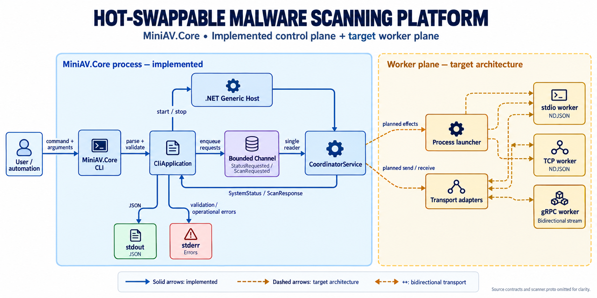

# MiniAV

MiniAV is a .NET 10 system-design project that models the control plane of a
multi-process antivirus system. It focuses on a single-writer coordination model,
process and transport boundaries, correlation IDs, failure isolation, and
blue-green worker replacement.

> [!IMPORTANT]
> MiniAV is not an antivirus product. The scanner is currently a technical stub:
> it does not open, read, or execute files, and it does not produce malware
> verdicts. The `filePath` value is metadata used only to demonstrate routing.

## Architecture



The CLI is the only control surface. Each invocation creates a host, runs exactly
one command, writes the result as JSON, and shuts down. The project does not
include an HTTP control API, a resident web server, an AppHost, or
ServiceDefaults.

See the [system architecture document](docs/architecture.md) for the component
map, runtime flows, protocol, lifecycle, failure model, and implementation
roadmap.

## Repository Structure

```text
MiniAV.sln
src/
  MiniAV.Core/       CLI, coordinator, and orchestration abstractions
  MiniAV.Scanner/    Scanner process stub
  MiniAV.Shared/     Shared C# contracts and protobuf; no standalone project
tests/
  MiniAV.Tests/      Unit and CLI integration tests
tools/
  miniav.ps1         PowerShell wrapper for the CLI
docs/
  PRD.md
  architecture.md
```

`MiniAV.Core` and `MiniAV.Scanner` compile the C# contracts from
`MiniAV.Shared` directly. From the same `scanner.proto` definition, Core
generates the gRPC client while Scanner generates the gRPC server.

## Requirements

- .NET SDK `10.0.203`, or a compatible patch version as configured in
  `global.json`.
- PowerShell, if you want to use the `tools/miniav.ps1` wrapper.

## Build and Test

From the repository root, run:

```powershell
dotnet restore MiniAV.sln
dotnet build MiniAV.sln --configuration Release
dotnet test MiniAV.sln --configuration Release
```

## CLI Usage

Run the CLI directly with the .NET CLI:

```powershell
dotnet run --project src/MiniAV.Core -- status
dotnet run --project src/MiniAV.Core -- scan C:\samples\demo.txt
dotnet run --project src/MiniAV.Core -- update stdio-scanner C:\manifests\stdio-v2.json
dotnet run --project src/MiniAV.Core -- --help
```

Alternatively, use the PowerShell wrapper from any working directory:

```powershell
.\tools\miniav.ps1 status
.\tools\miniav.ps1 scan C:\samples\demo.txt
```

Successful commands write JSON to standard output. Validation and operation
errors are written to standard error and return a non-zero exit code.

## Documentation

- [Product Requirements Document](docs/PRD.md)
- [System Architecture](docs/architecture.md)
